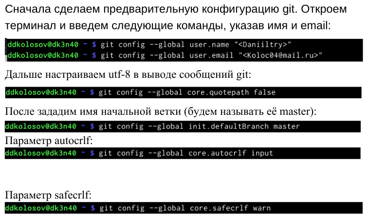
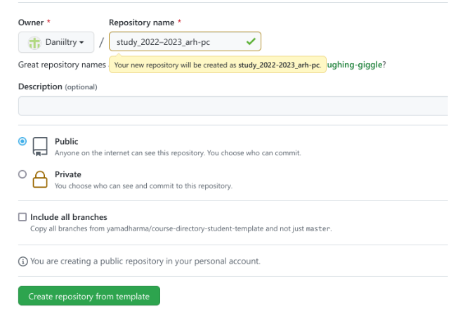
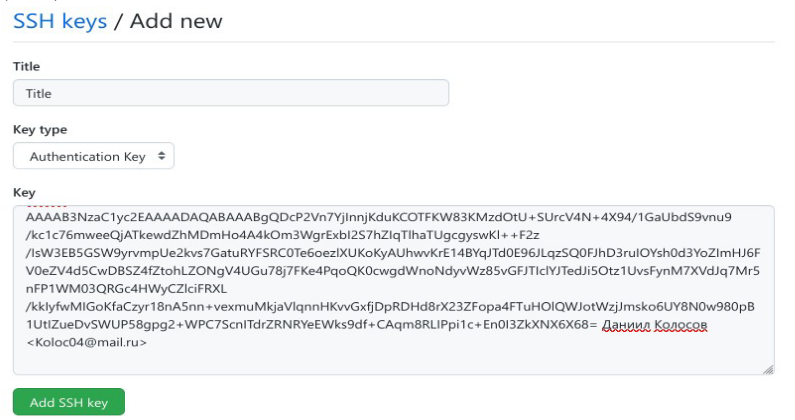
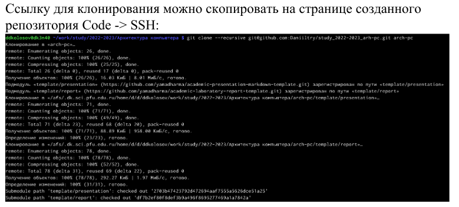
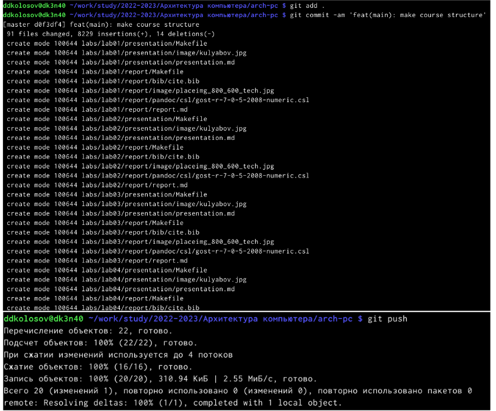
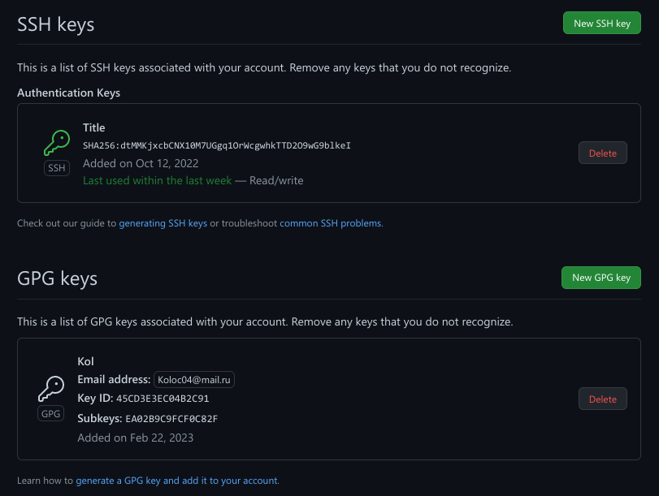

---
## Front matter

title: "Лабораторная работа 3. Markdown."
subtitle: "Настройка github"
author: "Колосов Даниил Дмитриевич"

## Generic otions
lang: ru-RU
toc-title: "Содержание"

## Bibliography
bibliography: bib/cite.bib
csl: pandoc/csl/gost-r-7-0-5-2008-numeric.csl

## Pdf output format
toc: true # Table of contents
toc-depth: 2
lof: true # List of figures
lot: true # List of tables
fontsize: 12pt
linestretch: 1.5
papersize: a4
documentclass: scrreprt

## I18n polyglossia
polyglossia-lang:
  name: russian
  options:
 	- spelling=modern
 	- babelshorthands=true
polyglossia-otherlangs:
 name: english
 
## I18n babel
babel-lang: russian
babel-otherlangs: english

## Fonts
mainfont: PT Serif
romanfont: PT Serif
sansfont: PT Sans
monofont: PT Mono
mainfontoptions: Ligatures=TeX
romanfontoptions: Ligatures=TeX
sansfontoptions: Ligatures=TeX,Scale=MatchLowercase
monofontoptions: Scale=MatchLowercase,Scale=0.9

## Biblatex
biblatex: true
biblio-style: "gost-numeric"
biblatexoptions:
  - parentracker=true
  - backend=biber
  - hyperref=auto
  - language=auto
  - autolang=other*
  - citestyle=gost-numeric
 
## Pandoc-crossref LaTeX customization
figureTitle: "Рис."
tableTitle: "Таблица"
listingTitle: "Листинг"
lofTitle: "Список иллюстраций"
lotTitle: "Список таблиц"
lolTitle: "Листинги"

## Misc options
indent: true
header-includes:
  - \usepackage{indentfirst}
  - \usepackage{float} # keep figures where there are in the text
  - \floatplacement{figure}{H} # keep figures where there are in the text
---

# Цель работы

Научиться оформлять отчёты с помощью легковесного языка разметки Markdown.

# Задание

– Сделайте отчёт по предыдущей лабораторной работе в формате Markdown.
– В качестве отчёта просьба предоставить отчёты в 3 форматах: pdf, docx и md (в архиве,
поскольку он должен содержать скриншоты, Makefile и т.д.)

# Выполнение лабораторной работы

1.Задаем имя и email владельца репозитория:
Задаем имя начальной ветки (будем называть её master):

{#fig:001 width=90%}

Генерируем ключ
Cкопируем наш сгенерированные ключи в буфер обмена+

{#fig:009 width=90%}

{#fig:002 width=90%}

Необходимо создать шаблон рабочего пространства
Например, для 2022–2023 учебного года и предмета «Операционные системы»

{#fig:005 width=90%}

Удалим лишние файлы
Создайте необходимые каталоги:
Отправьте файлы на сервер:

{#fig:007 width=90%}

Проверка

{#fig:004 width=90%}

# Вывод

Научились делать отчет в Markdown.

# Список литературы{.unnumbered}

::: {#refs}
:::
