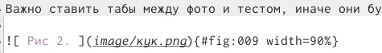
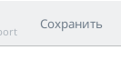
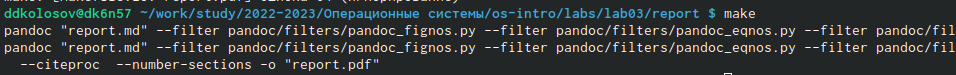
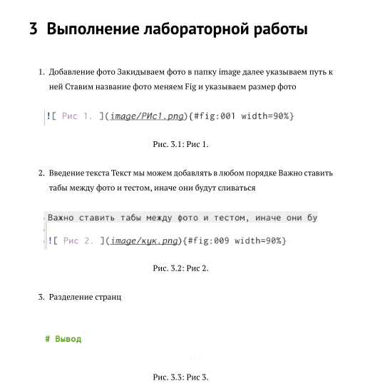

---
## Front matter
lang: ru-RU
title: Лабороторная работа №3
subtitle: Markdown
author:
  - Колосов Даниил Дмитриевич
institute:
  - Российский университет дружбы народов, Москва, Россия
date: 25 февраля 2023 г.

## i18n babel
babel-lang: russian
babel-otherlangs: english

## Formatting pdf
toc: false
toc-title: Содержание
slide_level: 2
aspectratio: 169
section-titles: true
theme: metropolis
header-includes:
 - \metroset{progressbar=frametitle,sectionpage=progressbar,numbering=fraction}
 - '\makeatletter'
 - '\beamer@ignorenonframefalse'
 - '\makeatother'
---

# Информация

## Докладчик

:::::::::::::: {.columns align=center}
::: {.column width="70%"}

  * Колосов Даниил Дмитриевич
  * студент группы НБИбд-02-22
  * Российский университет дружбы народов
  
:::
::: {.column width="30%"}

:::
::::::::::::::

# Вводная часть

## Цели и задачи

Научиться оформлять отчёты с помощью легковесного языка разметки Markdown.

## Содержание исследования

1. Добавление фото
Закидываем фото в папку image
далее указываем путь к ней
Ставим название фото
меняем Fig и указываем размер фото

{#fig:001 width=90%}

##

2. Введение текста
Текст мы можем добавлять в любом порядке
Важно ставить табы между фото и тестом, иначе они будут сливаться

{#fig:002 width=90%}

##

3. Разделение странц

{#fig:003 width=90%}

##

4. После всех действий нажимаем кнопкук сохранить

{#fig:004 width=90%}

##

5. Закрываем и в консоли с указанием путя пишем make

{#fig:005 width=90%}

##

6. Проверяем и радуемся жизни.

{#fig:006 width=90%}

## Результаты

- Освоили принципы разметки языка Markdown
- Создали отчет по ЛР №2

## Итоговый слайд

Markdown упрощает работу с тектовыми документами и разметкой, помогает быстро и качественно составлять большие файлы, отчеты и т.п.

:::

