---
## Front matter
lang: ru-RU
title: "Лабороторная работа №4"
subtitle: "Основы интерфейса взаимодействия
пользователя с системой Unix на уровне командной строки"
author:
  - Колосов Даниил Дмитриевич
institute:
  - Российский университет дружбы народов, Москва, Россия
date: 25 февраля 2023 г.

## i18n babel
babel-lang: russian
babel-otherlangs: english

## Formatting pdf
toc: false
toc-title: Содержание
slide_level: 2
aspectratio: 169
section-titles: true
theme: metropolis
header-includes:
 - \metroset{progressbar=frametitle,sectionpage=progressbar,numbering=fraction}
 - '\makeatletter'
 - '\beamer@ignorenonframefalse'
 - '\makeatother'
---

# Информация

## Докладчик

:::::::::::::: {.columns align=center}
::: {.column width="70%"}

  * Колосов Даниил Дмитриевич
  * студент группы НБИбд-02-22
  * Российский университет дружбы народов
  
:::
::: {.column width="30%"}

:::
::::::::::::::

## Цели и задачи

Приобретение практических навыков взаимодействия пользователя с системой по-
средством командной строки.

## Содержание исследования

1. Определяем полное имя вашего домашнего каталога
Перейдите в каталог /tmp.
Выведите на экран содержимое каталога /tmp. Для этого используйте команду ls
с различными опциями. Поясните разницу в выводимой на экран информации.

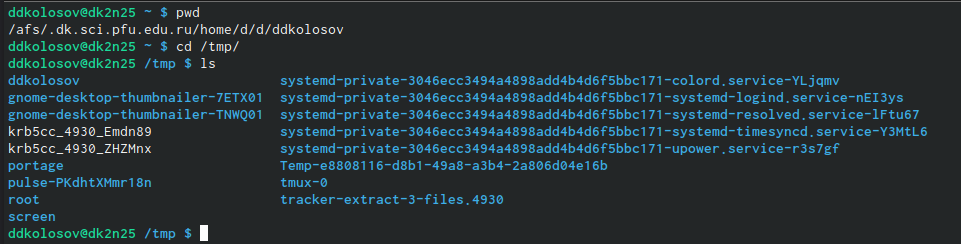{#fig:001 width=90%}

##

2. Определите, есть ли в каталоге /var/spool подкаталог с именем cron?

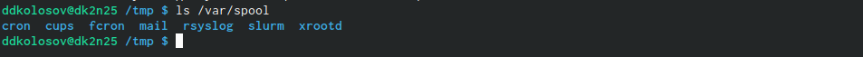{#fig:002 width=90%}

##

3. В домашнем каталоге создайте новый каталог с именем newdir.

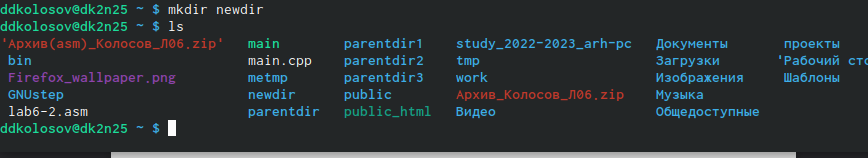{#fig:003 width=90%}

##

4. каталоге ~/newdir создайте новый каталог с именем morefun.
В домашнем каталоге создайте одной командой три новых каталога с именами
letters, memos, misk. Затем удалите эти каталоги одной командой.

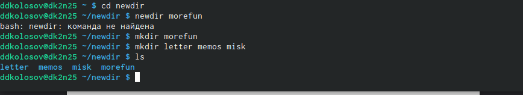{#fig:004 width=90%}

##

5. В домашнем каталоге создайте одной командой три новых каталога с именами
letters, memos, misk. Затем удалите эти каталоги одной командой.
Попробуйте удалить ранее созданный каталог ~/newdir командой rm. Проверьте,
был ли каталог удалён.

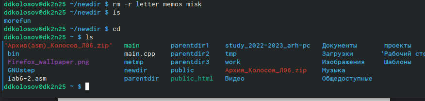{#fig:005 width=90%}

##

6. Удалите каталог ~/newdir/morefun из домашнего каталога. Проверьте, был ли
каталог удалён.

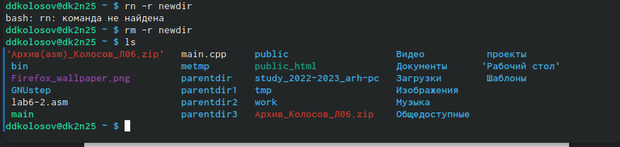{#fig:006 width=90%}

##

7. используя команду man открываем файлы

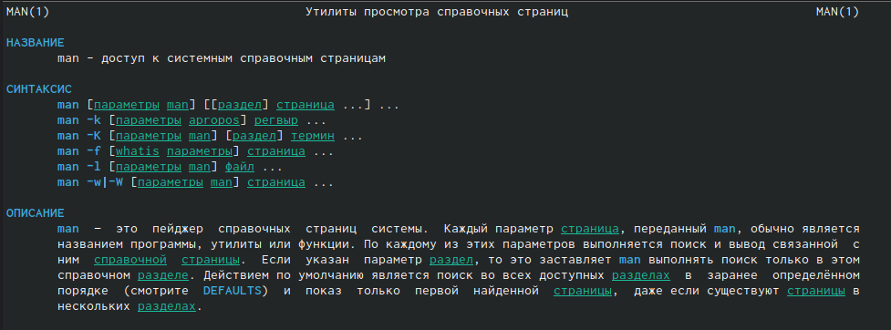{#fig:007 width=90%}

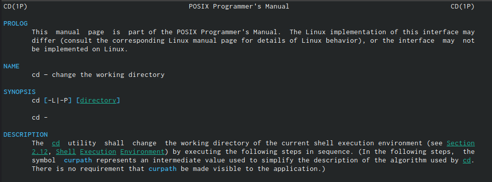{#fig:008 width=90%}

##

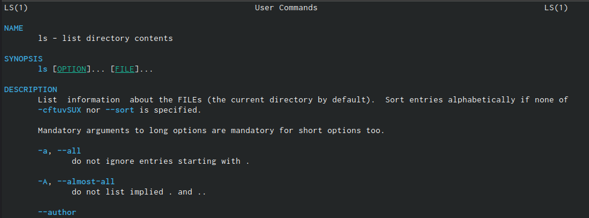{#fig:009 width=90%}

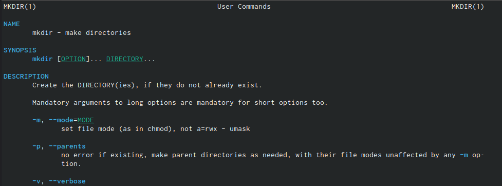{#fig:010 width=90%}

##

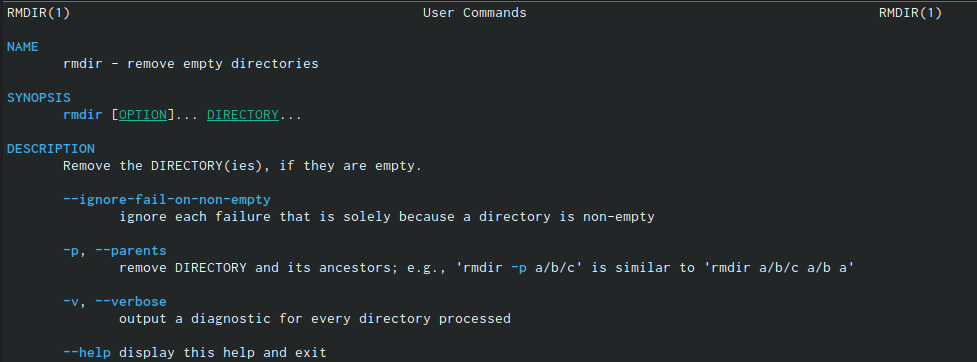{#fig:011 width=90%}

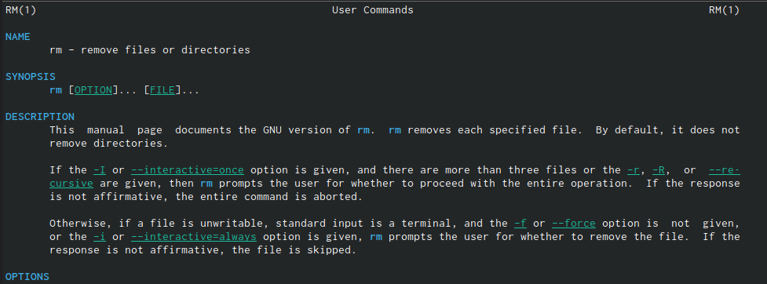{#fig:012 width=90%}

##

8. используем команду history

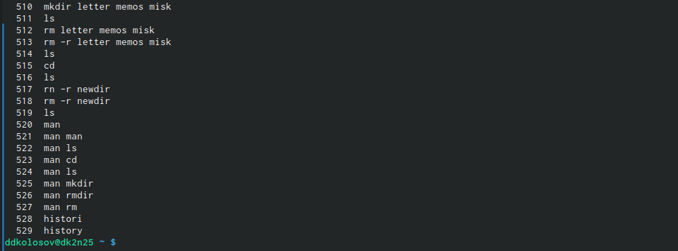{#fig:013 width=90%}

## Результаты

- Создали отчет по ЛР №4

## Итоговый слайд

Приобрели практические навыки взаимодействия пользователя с системой по-
средством командной строки.

:::

