---
## Front matter
lang: ru-RU
title: Индивидуальный проект.
subtitle: Этап 1.
author:
  - Колосов. Д. Д.
institute:
  - Российский университет дружбы народов, Москва, Россия
  - Объединённый институт ядерных исследований, Дубна, Россия
date: 22 февраль 2023

## i18n babel
babel-lang: russian
babel-otherlangs: english

## Formatting pdf
toc: false
toc-title: Содержание
slide_level: 2
aspectratio: 169
section-titles: true
theme: metropolis
header-includes:
 - \metroset{progressbar=frametitle,sectionpage=progressbar,numbering=fraction}
 - '\makeatletter'
 - '\beamer@ignorenonframefalse'
 - '\makeatother'
---

# Информация

## Докладчик

:::::::::::::: {.columns align=center}
::: {.column width="70%"}

  * Колосов Даниил Дмитриевич
  * 
  * 
  * Российский университет дружбы народов
  * [](mailto:kulyabov-ds@rudn.ru)
  * <https://yamadharma.github.io/ru/>

:::
::: {.column width="30%"}

:::
::::::::::::::

# Вводная часть

## Актуальность

- Научная презентация --- рабочий инструмент исследователя
- Необходимо создавать презентацию быстро
- Желательна минимизация усилий для создания презентации

## Объект и предмет исследования

- Презентация как текст
- Программное обеспечение для создания презентаций
- Входные и выходные форматы презентаций

## Цели и задачи

- Сделать презентацию для защиты 
- Описать алгоритм создания 

## Материалы и методы

- формат Markdown
- Результирующие форматы
	- `pdf`
	- `html`
- Автоматизация процесса создания: `Makefile`

# Создание презентации

## Процессор `pandoc`

- Pandoc: преобразователь текстовых файлов
- Сайт: <https://pandoc.org/>
- Репозиторий: <https://github.com/jgm/pandoc>

## Формат `pdf`

- Использование LaTeX
- Пакет для презентации: [beamer](https://ctan.org/pkg/beamer)
- Тема оформления: `metropolis`

## Код для формата `pdf`

```yaml
slide_level: 2
aspectratio: 169
section-titles: true
theme: metropolis
```

## Формат `html`

- Используется фреймворк [reveal.js](https://revealjs.com/)
- Используется [тема](https://revealjs.com/themes/) `beige`

## Код для формата `html`

- Тема задаётся в файле `Makefile`

```make
REVEALJS_THEME = beige 
```
# Результаты

## Получающиеся форматы

- Полученный `pdf`-файл можно демонстрировать в любой программе просмотра `pdf`
- Полученный `html`-файл содержит в себе все ресурсы: изображения, css, скрипты

# Элементы презентации

## Актуальность

- Даёт понять, о чём пойдёт речь
- Следует широко и кратко описать проблему
- Мотивировать свое исследование
- Сформулировать цели и задачи
- Возможна формулировка ожидаемых результатов

## Цели и задачи

1.Скачиваем файл Hugo из с сайта github

{#fig:013 width=70%}

создаем файл bin и закидываем скаченный файл туда 
далее создаем репризиторий в github 
копируем ключ 
и скаием в наш Dan 
и ппроверяем

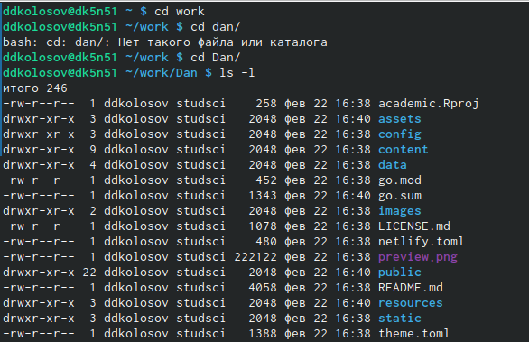{#fig:001 width=70%}

##

Далее заходим и удаляем файл public

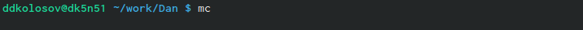{#fig:002 width=70%}

Далее выполняем следующую команду. Получаем ссылку в конце и переходим на нее.

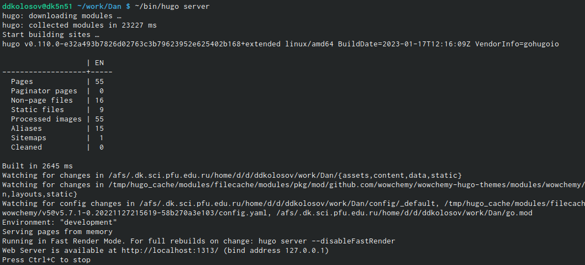{#fig:003 width=70%}

и попадаем на наш будующий сайт 
создаем репризиторий и правильно называем его 
Далее проверяем

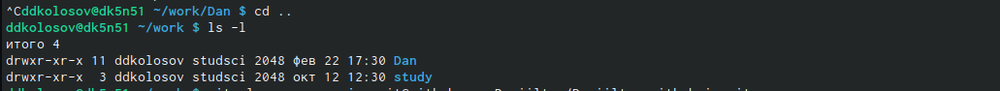{#fig:004 width=70%}

##

Далее клонируем репризиторий
и автоматом создается каталог

{#fig:005 width=70%}
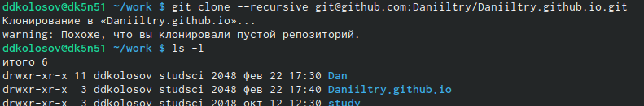{#fig:006 width=70%}

переходит в наш каталог 
создаем ветку main
создаем пустой файл
добавляем файл в репризиторий

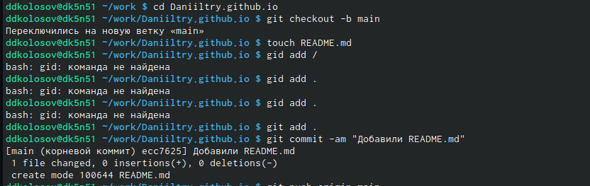{#fig:007 width=70%}

переносим в ветку main
и проверяем

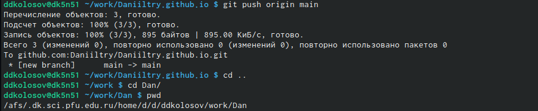{#fig:008 width=70%}

##

Добавим в ветку main 
и создаем publik
Далее убираем из игнора слово publik
и проверяем

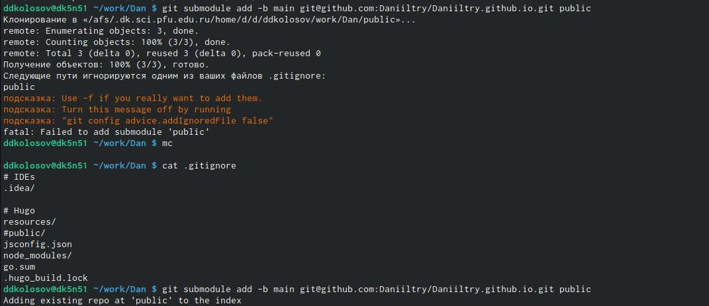{#fig:009 width=70%}

##

Добавляем файлы 
и сайт

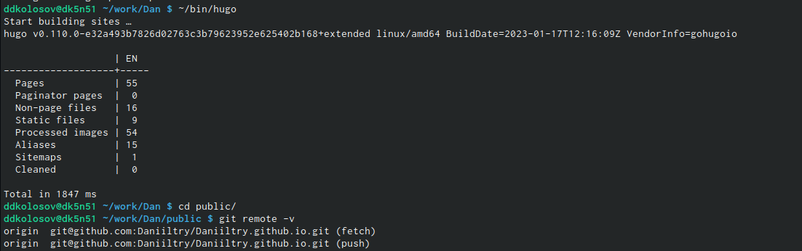{#fig:010 width=70%}

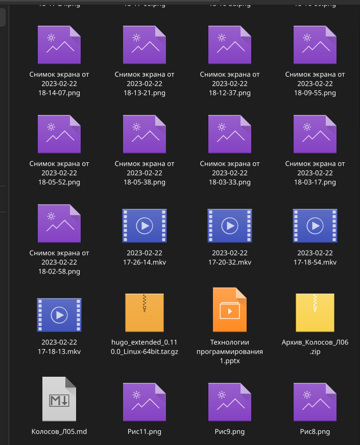{#fig:014 width=70%}

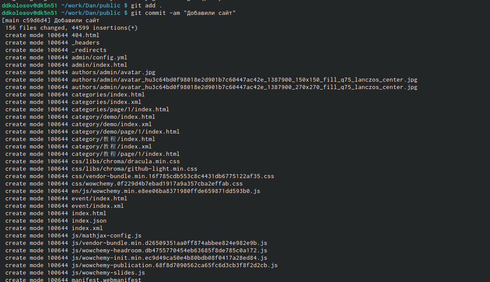{#fig:011 width=70%}


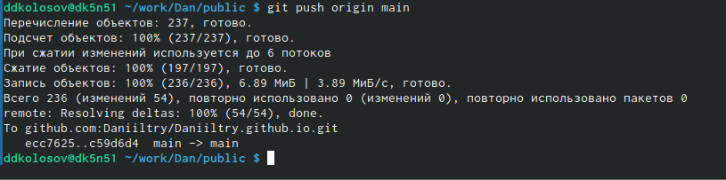{#fig:012 width=70%}

:::

